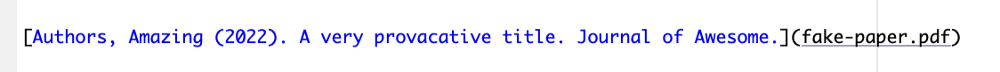

# Create a free portfolio website in 10 easy steps


## Why should you do it this way?

-   Once you're set up - its *really* easy to make changes

-   You don't have to mess with formatting - it just looks nice

-   But you *can* mess around with formatting and themes if you like

-   Its FREE and you get a cool github URL aka immediate street cred

-   Setup is pretty simple - I'd wager using this approach has a similar learning curve to squarespace or wix and will be faster.

## Resources

The example website from this guide is here: <https://rbcavanaugh.github.io>

There are lots of great instructions for creating your own website using distill. Once you get the hang of it, editing is very easy. Plus it's free!

The main distill website is here: <https://rstudio.github.io/distill/website.html>

There's a really nice tutorial here: <https://themockup.blog/posts/2020-08-01-building-a-blog-with-distill/>

## Using this repository as a template

We will use this repository as a template for your own website.

It's set up to be a simple website that will let you include

-   a page about you

-   a page about your research

-   your CV

Once you're up and running, it's easy to increase the complexity as much as you wish.

**Bonus**: You barely need to know any R code to make this work

**Caveat**: You will have to learn a few *very* basic git/github commands.

## Step 1: Create a github account

Link: <https://github.com>.

For your username, select something that you would like to use as part of your portfolio website URL.

For example, my github username is rbcavanaugh. The portfolio website example here is set to rbcavanaugh.github.io

## Step 2. Copy the template

1.  Once you're logged into github, go to <https://github.com/rbcavanaugh/rbcavanaugh.github.io> and select the big green button "Use this template".
2.  Name the repository the same way i have: username.github.io where username is your username (for example, mine is rbcavanaugh.github.io because rbcavanaugh is my username).
3.  Once your repository is set up (you should be taken to a page that has **username/username.github.io** in the top left), click the green code button and copy the url that you see (there's a copy button on the right).
4.  Go to the repository settings and select "Pages" in the menu on the left side of the page. Under branch, select "master" if it isn't already selected. Then select "/docs" right next to master and select save.

## Step 3. Create an Rstudio cloud account

link: <https://rstudio.cloud>.

RStudio cloud is free for 25 hours/month. It's unlikely you'll exceed this. If you do, time to download Rstudio to your own computer. But for now, its much easier to use RStudio cloud and skill the installation.

I recommend signing up with your new github account credentials rather than create a separate account if you're new to github.

*If you already have RStudio working on your local computer, you can use that too. The steps will be slightly different. Notes on differences will be in italics at the bottom of each step from here on.*

## Step 3: Create a new project in Rstudio Cloud

1.  On Rstudio cloud, select "new project"" and then choose "New project from git".
2.  Paste the URL you just copied and select "Ok". Your project should start to deploy - it may take a few minutes.

*If using desktop RStudio, select a new project by going to File in the top right of your computer screen, and then selecting "new project". Select the "version control" option, paste the url, and hit ok.*

## Step 4: Connect Rstudio cloud to github

Once your project has deployed, we need to make a few changes and some installation steps in RStudio.

You may be asked to install a few packages - generally you should do this.

1.  In the bottom right "Files" pane, rename the blue .Rproj file. It still says "rbcavanaugh.github.io.Rproj". You want it to say "username.github.io.Rproj".

2.  Open the setup.R file in the /R folder by clicking on it in the "Files" pane. Work through the few lines of code by carefully reading the code comments (preceeded by a '\#'). This is the only time you will need to run R code.

## Pause

Have you had any trouble installing packages or connecting Rstudio to github? If you have, now is the time to troubleshoot them. These are necessary at this point. If you're using Rstudio desktop and having issues, I suggest trying to get setup in Rstudio cloud.

## Step 5: Get oriented with Rstudio

In Rstudio - here's what you should be looking at:


-   **Top left pane** is where your scripts (.rmd files) go. You have a script for most pages on your website. The template website has 2 scripts, one for the home page (it must be called index.rmd) and one for a research page (research.rmd). There's also a .pdf file with an example CV. This will make up the third page of the website.

-   **Top right** **pane** has 6 different tabs. Two of them are important: "Build" and "Git". The "Build" tab has a button called "Build website". This renders all of your website code/documents together and copeies the results into the "docs" folder. You have to do this to see your changes and upload them. The "Git" tab holds update about transferring your website to github so it can go on the internet. More on this later.

-   **Bottom left pane** has two important tabs, "Console" and "Terminal". You will see R code run here sometimes. We will also run some git code in the terminal tab. It's really easy, I promise.

-   **Bottom right pane** is a file viewer, and helps you open, move, rename etc. files. If you ever need to navigate back to this home folder for your website, hit the blue cube with an "R" inside of it.

## Step 6: Website layout file "yml"

In Rstudio, open the file called "\_site.yml". This file holds key information about how your website is structured. Mine looks like this. For a script to be linked on your website, it should be listed here.

``` R
name: "rbcavanaugh.github.io"
title: "Rob Cavanaugh | PhD Student"
output_dir: "docs"
navbar:
  right:
    - text: "Home"
      href: index.html
    - text: "Research"
      href: research.html
    - text: "CV"
      href: cv-cavanaugh.pdf
output: distill::distill_article
```

*Important: The .yml file is both case sensitive and sensitive to whitespace. It's a bit annoying, but be careful about how each item is indented, because it does matter and you will get an error if the indent isn't right.*

Changes to make:

1.  Change the name of your website to your username.github.io
2.  Change the title of your website. This goes in the top left of the web page.
3.  Change the name of the .pdf file to represent what your pdf CV is called.
    1.  <div>

        -   If you don't a CV handy right now, you can "comment out" these two lines of code by putting a hashtag (also called pound sign) in front of the two CV lines so that they are not included. Like this:

        </div>

``` R
name: "rbcavanaugh.github.io"
title: "Rob Cavanaugh | PhD Student"
output_dir: "docs"
navbar:
  right:
    - text: "Home"
      href: index.html
    - text: "Research"
      href: research.html
#    - text: "CV"
#      href: cv-cavanaugh.pdf
output: distill::distill_article
```

## Step 7: Create your home page

Open the index.Rmd file.

The template file is pretty short. The whole script is just this right now:

    ---
    title: "Rob Cavanaugh - website demo"    
    site: distill::distill_website
    image: "images/profile.jpg"
    links:
      - label: Google Scholar
        url: https://scholar.google.com/citations?user=7pMLCJsAAAAJ&hl=en&oi=sra
      - label: Twitter
        url: https://twitter.com/rb_cavanaugh
      - label: Email
        url: mailto:rob.cavanaugh@pitt.edu
    output:
      postcards::jolla
    ---

    I'm a PhD candidate at the [University of Pittsburgh](https://www.lrcl.pitt.edu/) and ASHA-certified speech-language pathologist. My research aims to improve the effectiveness and clinical implementation of aphasia rehabilitation services from two perspectives: (1) specifying the active ingredients of aphasia treatments and (2) developing technology-based tools to accelerate the clinical implementation of aphasia research.

To-do list:

1.  Change the title to reflect your name.
2.  Upload your profile image to the images/ folder and make sure that you have changed the filename in the `image:` line to match your profile image filename.
3.  Change the google scholar, twitter, and email links to be yours.
4.  you can add any other links here that you want. Other examples might be orcid, your ncbi page, your Pitt lab page, etc.
5.  Choose a template for your profile page. The different templates are shown here: <https://github.com/seankross/postcards>. You might want to add the text you want (next step) before worrying too much about the template. But you could change the current template from `postcards::jolla` to `postcards::trestles` for example. Remember to make sure not to change the amount of indent on that line.
6.  Update the paragraph below with your own content. The formatting uses markdown writing style which you can preview here in section 3. <https://www.rstudio.com/wp-content/uploads/2015/02/rmarkdown-cheatsheet.pdf>.

## Step 8: Add your research

Open the research.Rmd folder. You'll that I'm using headers for "Publications" and for "Presentations". Feel free to change this however you would like. I've just copied and pasted a few items from my CV here as an example.

**Bonus: self-archiving:** If you want to link to a self-archived paper, you could do it like such - surrounding the citation in square brackets, and putting the file, which you've saved in your folder, in parentheses after. If you're not sure about self-archiving, see: <https://www.csdisseminate.com>.



results in:

[Authors, Amazing (2022). A very provacative title. Journal of Awesome.](fake-paper.pdf)

## Step 9: Send your website to github

1.  In the top right pane of Rstudio, click on "Build Website". Lets hope you don't get any errors! If you do, its probably a .yml error. If successful, you should see a pop-up of your website (this is a local preview). In Rstudio cloud, you may need to allow pop-ups...

2.  If it looks good, move on to step 3. If not, fix it. Or don't and move on anyway.

3.  Ok - now we need to send the website files to github.

In the bottom right of Rstudio, select Terminal (its right next to console). You're going to type in 3 lines of git code (horray for learning git!).


This image shows you what you're going to be doing. Right now, your changes are in your working directory (the factory where you make stuff). We need to send them to the local repository (the place that holds information about your files and the changes you made to them on your computer). After that, we need to send them from the local repository to github, (the remote repository) so that they can be published online.

In the terminal, type these three lines verbatim.

`git add .`

"Add the changes" - This is like packing up your chagnes and getting them ready to ship to the local repo. The period in the line of code means add all the changes.

`git commit -m "This is the first time I'm sending changes"`

"Commit" the changes. This is your UPS driver taking the changes to the local repository. the `-m` adds a message to go along with your changes. You need to include a message, and its good practice to include something useful.

`git push`

"Push" the changes. This send sthe changes from your local repository to github.

## Step 10: Publish your website!

Last, go back to your github repository.

Go to the repository settings and select "Pages" in the menu on the left side of the page. you should see something that says:

"Your site is live at <https://rbcavanaugh.github.io/>"

If not, make sure that the "branch" is set to "master" and that the option next to this says "/docs".

Wait a few minutes and refresh the page again. Click on the link to go see your new website!.

## Troubleshooting

Hey now that you have a github account, you can raise issues! If you're stuck, go to my template page (<https://github.com/rbcavanaugh/rbcavanaugh.github.io>), select issues, create a new issue, and let me know where you're stuck. Include error messages, maybe a screen shot or two. I'll help you out.

## FAQ

**Q: What if I just want a single page website?**

A: Fantastic! Delete everything in your project except the following, build the website, and send to github like normal.

-   index.Rmd

-   Your .Rproj file

-   the images folder

-   Your CV (you can link to your CV the same way you link to papers in step 8 above)

**Q: Are there more themes or layouts?**

A: yes! There are lots of themes. We've used the {distill} R package to create this website because its very easy. There are other options out there. (Quarto, Jekyll being two of them).

## Next Steps:

-   Click through the distill website for other features you want to include: <https://rstudio.github.io/distill/>

-   You could change the coloring, the themes, font.

-   Add another page. Maybe you want a page for pictures of your cat.

-   Add a blog. Think livejournal but 25 years later. .

-   Go do some actual work :)
